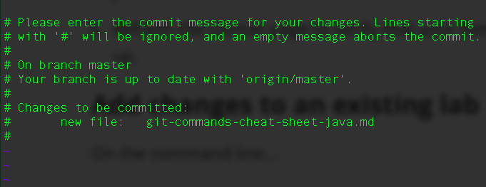
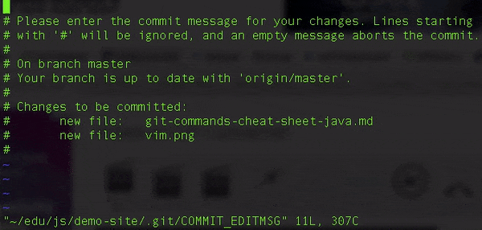

# Git Commands Cheat Sheet

### Upload a new project

1. On the command line...

   1. `cd` into the lab folder.
   2. `git init` to initialize the local Git repository. Only do this one time per project!
   3. `git add .` to add all the files in the project to the staging area. Or `git add <file/folder>` to add a specific file or folder. Include the name or path of the file or folder. Do not include the angle brackets (<, >).
   4. `git commit -m 'initial commit'` to make the first commit.

2. On GitHub.com, log in and create a new repository. Give it a name, such as "Lab2", and leave all the other options as they are.

3. Copy both lines under "…or push an existing repository from the command line" on GitHub, paste them on the command line, and press ENTER.

4. Refresh the GitHub page to verify that your files have been copied up.

### Add changes to an existing project

On the command line...

1. `git add .` to add all changes in the project to the staging area.
2. `git commit -m 'Describe change'` - but replace Describe Change with your own description of the change you're making. Be sure to put the single-quotes around it as in this example.
3. `git push` to copy the commit to GitHub.
4. (optional) Go to GitHub.com and check that your changes are there.

### Vim

When working with Git, you may run into this screen...

It's a command line program called Vim. You need to know how to exit this program correctly. To do so, type the following keys one-by-one.

1. `ESC`
2. `:` (Hold `SHIFT` and press the `:` key)
3. `x`
4. `ENTER`

Here's what it looks like...

### List of commands

* `git init` - Initialize (create) a new local repository. Only do this once per project.
* `git add <file/folder>` - Add a file or folder to the staging area. Include the name or path of the file or folder. Do not include the angle brackets (<, >).
* `git commit -m '<message>'` - Commit the staging area changes as a snapshot on the repository timeline. Replace `<message>` with a description of the changes you're making. Do not include the angle brackets (<, >).
* `git push` - Push (copy) your committed changes to the remote repositroy (i.e. GitHub).
* `git pull` - Pull (copy) changes from a remote (i.e. GitHub) repository to your computer.
* `git status` - View the current changes and staging area
* `git diff <file>` - View changes to a file that is unstages.
* `git diff --staged <file>` - View changes to a file that is staged. (What lines were added, removed, and modified?)
* `git log` - View list of commits in the repository snapshot timeline.
* `git show <commit hash>` - View details about a particular commit.
* `git remote -v` - View which remote repository (i.e. GitHub repository) this repo is linked to, if any.
* `git remote add origin <GitHub URL>` - Link to a remote repository (i.e. a GitHub repo).
* `git push -u origin master` - The first push to the remote repository. Sets up for future pushes with simply `git push`.
* `git clone <GitHub URL>` - Download and link a copy of a remote GitHub repository onto your computer. This creates a new folder on your computer.
* `git checkout <commit hash>` - temporarily go back to a commit
* `git checkout master` - return to the latest commit
* `git reset --hard <commit hash>` - undo back to an old commit
* `git push --force` - update GitHub after a reset
* `git reset --hard origin/master` - reset local repo to GitHub
* `git checkout -- <file>` - undo all changes to a file
* `git reset HEAD <file>` - remove a file from staging